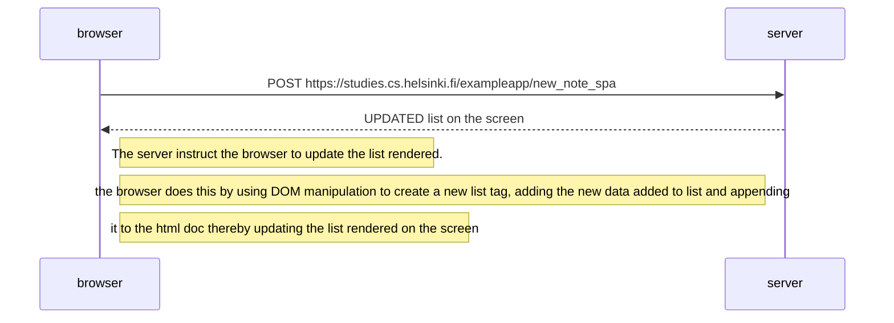

```mermaid
      sequenceDiagram
      participant browser
      participant server

      browser ->> server:POST https://studies.cs.helsinki.fi/exampleapp/new_note_spa
      server -->> browser: UPDATED list on the screen
          Note right of browser:The server instruct the browser to update the list rendered.
          Note right of browser:the browser does this by using DOM manipulation to create a new list tag, adding the new data added to list and appending
          Note right of browser:it to the html doc thereby updating the list rendered on the screen
```
