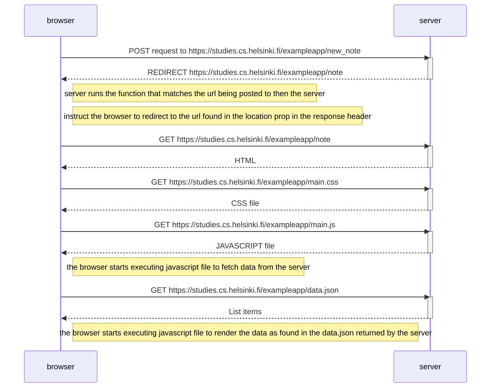

```mermaid
   sequenceDiagram
   participant browser
   participant server
  
   
   browser->> server : POST request to https://studies.cs.helsinki.fi/exampleapp/new_note
   activate server
   server-->>browser: REDIRECT https://studies.cs.helsinki.fi/exampleapp/note
   deactivate server
   Note right of browser: server runs the function that matches the url being posted to then the server 
   Note right of browser: instruct  the browser to redirect to the url found in the location prop in the response header
   
   browser->> server : GET  https://studies.cs.helsinki.fi/exampleapp/note
   activate server
   server-->>browser: HTML
   deactivate server
   
   browser->> server : GET  https://studies.cs.helsinki.fi/exampleapp/main.css
   activate server
   server-->>browser: CSS file
   deactivate server
   
   browser->> server : GET  https://studies.cs.helsinki.fi/exampleapp/main.js
   activate server
   server-->>browser: JAVASCRIPT file
   deactivate server
   Note right of browser: the browser starts executing javascript file to fetch data from the server
   
    browser->> server : GET  https://studies.cs.helsinki.fi/exampleapp/data.json
   activate server
   server-->>browser: List items
   deactivate server
  Note right of browser: the browser starts executing javascript file to render the data as found in the data.json returned by the server
   
```
