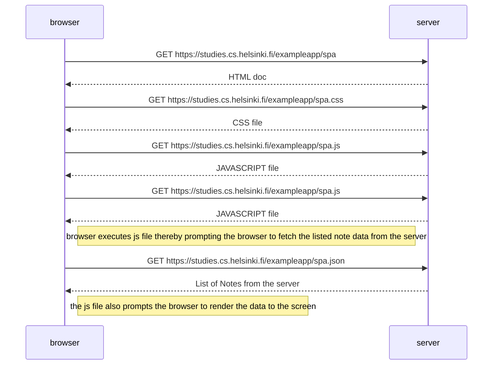

```mermaid
    sequenceDiagram
    participant browser
    participant server

    browser->>server: GET https://studies.cs.helsinki.fi/exampleapp/spa
    server-->>browser: HTML doc

    browser->>server: GET https://studies.cs.helsinki.fi/exampleapp/spa.css
    server-->>browser: CSS file

    browser->>server: GET https://studies.cs.helsinki.fi/exampleapp/spa.js
    server-->>browser: JAVASCRIPT file
    
    browser->>server: GET https://studies.cs.helsinki.fi/exampleapp/spa.js
    server-->>browser: JAVASCRIPT file
    Note right of browser: browser executes js file thereby prompting the browser to fetch the listed note data from the server

    browser->>server: GET https://studies.cs.helsinki.fi/exampleapp/spa.json
    server-->>browser: List of Notes from the server
    Note right of browser: the js file also prompts the browser to render the data to the screen
    

    
```
